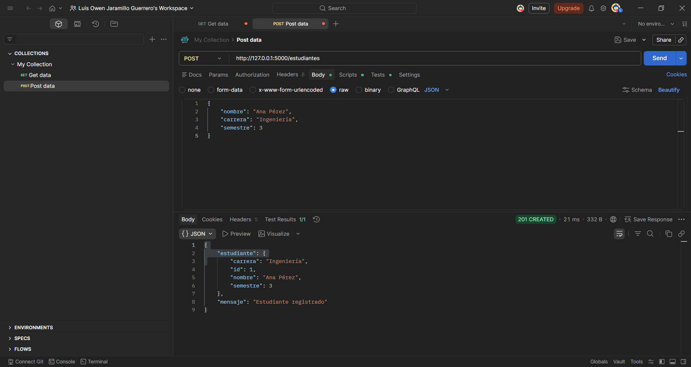

# API de Registro de Estudiantes

Este proyecto es una API desarrollada en **Flask** que permite **registrar estudiantes** en una base de datos y **consultar los registros almacenados**.  
Cada estudiante tiene: `nombre`, `carrera` y `semestre`.

---

## Tecnologías utilizadas

- Python 3
- Flask
- Flask-SQLAlchemy
- SQLite (base de datos)

---

## Instalación y ejecución

1. Clonar el repositorio:
```bash id="x1v9hj"
git clone <URL_DEL_REPOSITORIO>
cd flask_estudiantes_api
```

2.Crear y activar un entorno virtual (Windows PowerShell):
```bash id="x1v9hj"
python -m venv venv
.\venv\Scripts\Activate.ps1
```

3.Instalar dependencias:
```bash id="x1v9hj"
pip install Flask Flask-SQLAlchemy
```

4. Ejecutar la API:
```bash id="x1v9hj"
python app.py
```
La API quedará disponible en: http://127.0.0.1:5000/

---

## Endpoints

1. Agregar un estudiante (POST)

URL: /estudiantes

Método: POST

Body (JSON):

```bash id="x1v9hj"
{
    "nombre": "Ana Pérez",
    "carrera": "Ingeniería",
    "semestre": 3
}
```

Respuesta exitosa:
```bash id="x1v9hj"
{
    "mensaje": "Estudiante registrado",
    "estudiante": {
        "id": 1,
        "nombre": "Ana Pérez",
        "carrera": "Ingeniería",
        "semestre": 3
    }
}
```



